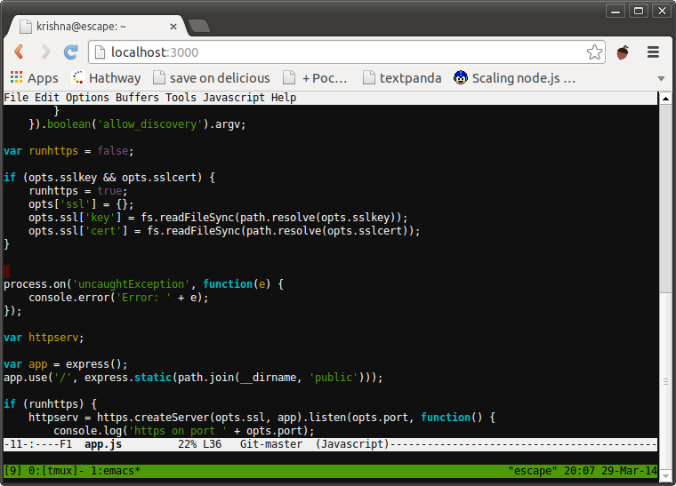

<!--
N.B.: This README was automatically generated by <https://github.com/YunoHost/apps/tree/master/tools/readme_generator>
It shall NOT be edited by hand.
-->

# Wetty for YunoHost

[](https://ci-apps.yunohost.org/ci/apps/wetty/)


[](https://install-app.yunohost.org/?app=wetty)

*[Read this README in other languages.](./ALL_README.md)*

> *This package allows you to install Wetty quickly and simply on a YunoHost server.*  
> *If you don't have YunoHost, please consult [the guide](https://yunohost.org/install) to learn how to install it.*

## Overview

Terminal over HTTP and HTTPS. WeTTy is an alternative to ajaxterm and anyterm but much better than them because WeTTy uses xterm.js which is a full fledged implementation of terminal emulation written entirely in JavaScript. WeTTy uses websockets rather then Ajax and hence better response time.


**Shipped version:** 2.7.0~ynh2

## Screenshots



## Documentation and resources

- Upstream app code repository: <https://github.com/butlerx/wetty>
- YunoHost Store: <https://apps.yunohost.org/app/wetty>
- Report a bug: <https://github.com/YunoHost-Apps/wetty_ynh/issues>

## Developer info

Please send your pull request to the [`testing` branch](https://github.com/YunoHost-Apps/wetty_ynh/tree/testing).

To try the `testing` branch, please proceed like that:

```bash
sudo yunohost app install https://github.com/YunoHost-Apps/wetty_ynh/tree/testing --debug
or
sudo yunohost app upgrade wetty -u https://github.com/YunoHost-Apps/wetty_ynh/tree/testing --debug
```

**More info regarding app packaging:** <https://yunohost.org/packaging_apps>
